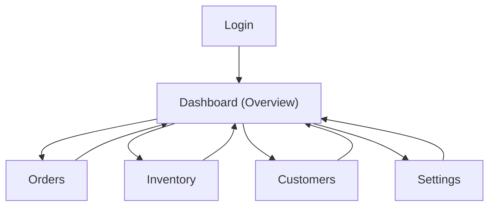

## 1. Product Overview
Streamline HQ is a web dashboard to monitor and manage core operations (orders, inventory, customers) in one place.
It provides real-time visibility via Supabase tables + subscriptions and supports PWA install for quick access.

## 2. Core Features

### 2.1 User Roles
| Role | Registration Method | Core Permissions |
|------|---------------------|------------------|
| Admin | Invite-only (email) | Manage org/workspace settings; full CRUD on operational data; manage members |
| Staff | Admin invite (email) | View dashboard; CRUD on orders/inventory/customers as allowed |

### 2.2 Feature Module
Our Streamline HQ requirements consist of the following main pages:
1. **Login**: sign in, password reset, session restore.
2. **Dashboard (Overview)**: KPI cards, recent activity, real-time updates, quick links.
3. **Orders**: order list, order details, status updates.
4. **Inventory**: product list, stock levels, low-stock alerts.
5. **Customers**: customer list, customer details, contact fields.
6. **Settings**: profile/org settings, member management, PWA install help.

### 2.3 Page Details
| Page Name | Module Name | Feature description |
|-----------|-------------|---------------------|
| Login | Authentication | Sign in with email/password; send password reset; redirect on success |
| Dashboard (Overview) | KPI summary | Show totals (e.g., open orders, low-stock count); auto-refresh via realtime |
| Dashboard (Overview) | Activity feed | Display latest changes/events from core tables; update in realtime |
| Dashboard (Overview) | Global navigation | Provide responsive sidebar/topbar; show current workspace/user menu |
| Orders | Order list | List orders with basic filters (status, date); open order detail |
| Orders | Order detail | View line items and customer; update status; show last-updated timestamp |
| Inventory | Inventory list | List products/stock; highlight low stock; open product detail |
| Inventory | Stock updates | Adjust stock quantity; record change as an event; update UI in realtime |
| Customers | Customer list | List customers; search by name/email; open customer detail |
| Customers | Customer detail | View/edit core customer fields; show related recent orders (read-only) |
| Settings | Workspace & members | View org/workspace; invite/remove members (Admin only) |
| Settings | PWA install | Show install instructions and installation state (installed / not installed) |

## 3. Core Process
**Admin Flow**: Sign in → land on Dashboard → monitor KPIs/activity → manage Orders/Inventory/Customers → configure Settings (workspace + members) → optionally install as PWA.

**Staff Flow**: Sign in → land on Dashboard → manage Orders/Inventory/Customers within permissions → optionally install as PWA.

