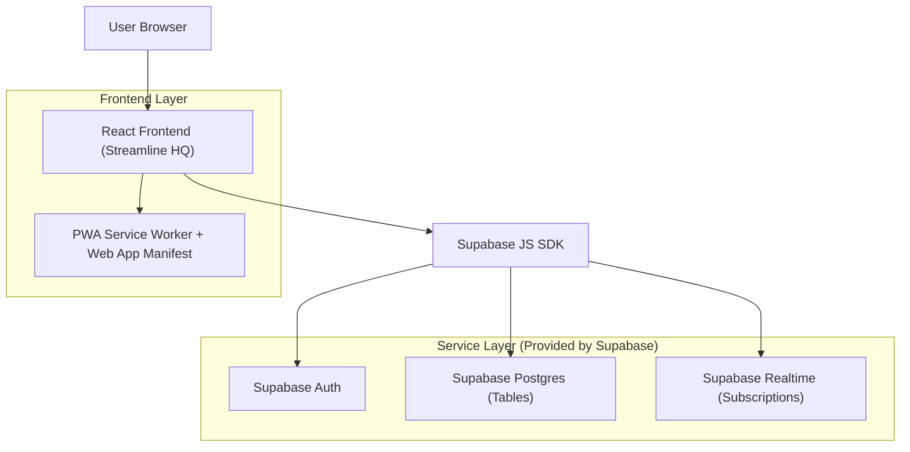
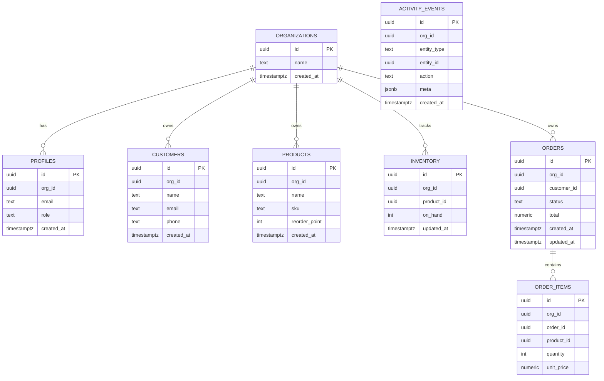

## 1.Architecture design


## 2.Technology Description
- Frontend: React@18 + TypeScript + vite + tailwindcss@3
- Backend: None (frontend uses Supabase SDK directly)
- BaaS: Supabase (Auth, Postgres, Realtime)
- PWA: Workbox (or Vite PWA plugin) for service worker + caching

## 3.Route definitions
| Route | Purpose |
|-------|---------|
| /login | Authenticate user (Supabase Auth) |
| / | Dashboard overview KPIs + activity feed |
| /orders | Orders list + order detail navigation |
| /inventory | Inventory list + stock adjustments |
| /customers | Customers list + customer detail |
| /settings | Workspace/profile/members + PWA install help |

## 6.Data model(if applicable)

### 6.1 Data model definition


### 6.2 Data Definition Language
Organizations (organizations)
```sql
CREATE TABLE organizations (
  id UUID PRIMARY KEY DEFAULT gen_random_uuid(),
  name TEXT NOT NULL,
  created_at TIMESTAMPTZ NOT NULL DEFAULT now()
);

-- basic grants (extend with RLS in Supabase)
GRANT SELECT ON organizations TO anon;
GRANT ALL PRIVILEGES ON organizations TO authenticated;
```

Profiles (profiles) — maps to auth.users via same id
```sql
CREATE TABLE profiles (
  id UUID PRIMARY KEY,
  org_id UUID NOT NULL,
  email TEXT NOT NULL,
  role TEXT NOT NULL CHECK (role IN ('admin','staff')),
  created_at TIMESTAMPTZ NOT NULL DEFAULT now()
);
GRANT SELECT ON profiles TO anon;
GRANT ALL PRIVILEGES ON profiles TO authenticated;
```

Operational tables (customers, products, inventory, orders, order_items, activity_events)
```sql
CREATE TABLE customers (
  id UUID PRIMARY KEY DEFAULT gen_random_uuid(),
  org_id UUID NOT NULL,
  name TEXT NOT NULL,
  email TEXT,
  phone TEXT,
  created_at TIMESTAMPTZ NOT NULL DEFAULT now()
);

CREATE TABLE products (
  id UUID PRIMARY KEY DEFAULT gen_random_uuid(),
  org_id UUID NOT NULL,
  name TEXT NOT NULL,
  sku TEXT,
  reorder_point INT NOT NULL DEFAULT 0,
  created_at TIMESTAMPTZ NOT NULL DEFAULT now()
);

CREATE TABLE inventory (
  id UUID PRIMARY KEY DEFAULT gen_random_uuid(),
  org_id UUID NOT NULL,
  product_id UUID NOT NULL,
  on_hand INT NOT NULL DEFAULT 0,
  updated_at TIMESTAMPTZ NOT NULL DEFAULT now()
);

CREATE TABLE orders (
  id UUID PRIMARY KEY DEFAULT gen_random_uuid(),
  org_id UUID NOT NULL,
  customer_id UUID,
  status TEXT NOT NULL,
  total NUMERIC NOT NULL DEFAULT 0,
  created_at TIMESTAMPTZ NOT NULL DEFAULT now(),
  updated_at TIMESTAMPTZ NOT NULL DEFAULT now()
);

CREATE TABLE order_items (
  id UUID PRIMARY KEY DEFAULT gen_random_uuid(),
  org_id UUID NOT NULL,
  order_id UUID NOT NULL,
  product_id UUID,
  quantity INT NOT NULL DEFAULT 1,
  unit_price NUMERIC NOT NULL DEFAULT 0
);

CREATE TABLE activity_events (
  id UUID PRIMARY KEY DEFAULT gen_random_uuid(),
  org_id UUID NOT NULL,
  entity_type TEXT NOT NULL,
  entity_id UUID NOT NULL,
  action TEXT NOT NULL,
  meta JSONB NOT NULL DEFAULT '{}'::jsonb,
  created_at TIMESTAMPTZ NOT NULL DEFAULT now()
);

GRANT SELECT ON customers, products, inventory, orders, order_items, activity_events TO anon;
GRANT ALL PRIVILEGES ON customers, products, inventory, orders, order_items, activity_events TO authenticated;
```

Realtime subscriptions
- Subscribe to INSERT/UPDATE on: orders, inventory, activity_events.
- Use org_id filter in queries and channel filters to limit events per workspace.